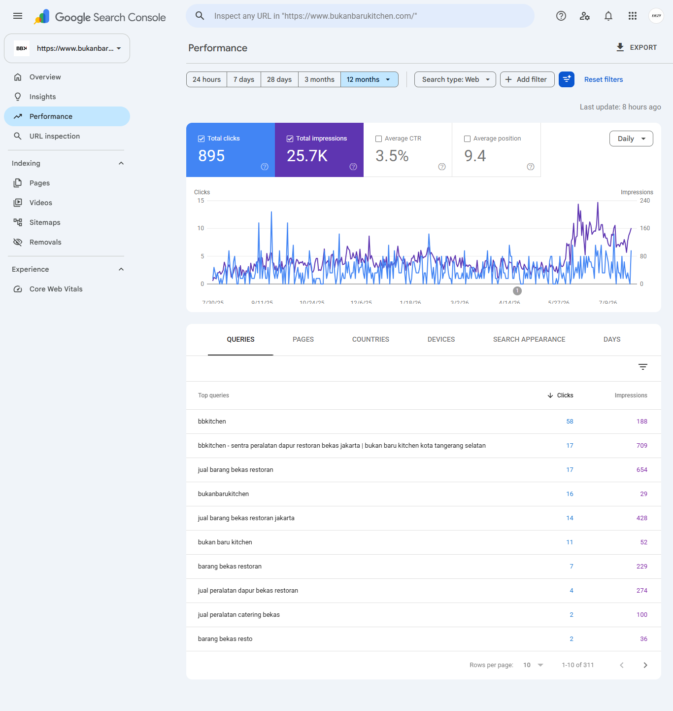

# BBKitchen — Automated Organic Growth & AI-Driven Inventory Pipeline

> A production workflow that transforms fragmented inventory from independent Telegram supplier groups into structured, SEO-ready WooCommerce product listings.

## Project Overview

**BBKitchen (Bukan Baru Kitchen)** is a used commercial kitchen equipment business operating through **bukanbarukitchen.com**.

BBKitchen is supported by an organic growth and inventory automation system built to manage fragmented inventory without owning the upstream warehouse inventory.

Products are sourced through a network of independent warehouse owners and administrators who publish available equipment inside private Telegram groups.
This creates an unusual operational environment:

- Inventory is controlled by independent suppliers.
- Each supplier uses different naming and caption conventions.
- Product specifications are inconsistent.
- Product photos arrive in different formats and groupings.
- Availability and sold status are communicated differently.
- Multiple independent marketers can compete to sell inventory from the same supplier network.
- New inventory needs to become searchable and commercially usable quickly.

Instead of manually copying products from Telegram into an e-commerce catalog, I built an automation pipeline that converts fragmented supplier data into structured product records and publication-ready assets.

The system combines:

```text
Python
Google Sheets
Google Apps Script
Google Drive
OpenAI API
WordPress / WooCommerce
```

---

# The Problem

The upstream inventory environment looks conceptually like this:

```text
Independent Supplier A ─┐
Independent Supplier B ─┤
Independent Supplier C ─┤
Independent Supplier D ─┤
Independent Supplier E ─┼──> Telegram ──> Resellers / Marketers
Independent Supplier F ─┤
Independent Supplier G ─┤
Independent Supplier H ─┤
Additional Sources ─────┘
```

The business does not control how those suppliers structure their data.

The same type of product can therefore appear in very different formats.

Example conceptual inputs:

```text
Source A:
deep fryer gas 2 basket ex resto 40x70 kondisi bagus

Source B:
FRYER 2TUNGKU
uk 40 70
second
minus lecet

Source C:
deep fryer restoran bekas

Source D:
SOLD
```

At larger inventory volumes, manually transforming these messages into structured website listings creates a long operational chain:

```text
Monitor Telegram
      ↓
Interpret captions
      ↓
Identify product units
      ↓
Download images
      ↓
Rename images
      ↓
Compress images
      ↓
Apply watermark
      ↓
Determine category
      ↓
Write product title
      ↓
Write product content
      ↓
Generate SEO metadata
      ↓
Upload media
      ↓
Publish to WooCommerce
      ↓
Track publication state
```

The objective was to turn this fragmented process into a repeatable growth workflow.

---

# The Solution

BBKitchen uses a staged automation architecture:

```text
Telegram Supplier Groups
          |
          v
   Python Extraction
          |
          v
 JSON + Product Images
          |
          v
 Parsing / Media Processing
          |
          v
    RAW_INVENTORY
          |
          v
   OpenAI Enrichment
          |
          v
   MASTER_INVENTORY
          |
          v
 Google Drive Media Sync
          |
          v
   READY_TO_PUBLISH
          |
          v
 WordPress REST Endpoint
          |
          v
      WooCommerce
          |
          v
      PUBLISHED
          |
          v
 WooCommerce Callback
          |
          v
   MASTER_INVENTORY
```

The architecture intentionally separates deterministic automation from semantic AI processing.

```text
DETERMINISTIC CODE

Fetch source data
Parse messages
Prevent duplicates
Generate SKUs
Process images
Manage pipeline state
Call APIs
Publish products
Archive files


AI

Interpret inconsistent captions
Normalize product information
Classify products
Generate commercial content
Generate SEO metadata
Generate image metadata
```

---

# Architecture

The complete architecture documentation is available here:

[`System Architecture`](./diagrams/system-architecture.md)

The system is divided into four primary operational layers.

---

## 1. Telegram Ingestion

Python retrieves inventory messages and images from multiple Telegram sources.

The extraction workflow supports date-based retrieval and stores source exports independently.

```text
Telegram API
     |
     v
telethon_fetch.py
     |
     +----> result.json
     |
     +----> source images
```

The parser then converts those exports into structured inventory units.

Existing Telegram message references stored in the operational database are used to prevent duplicate ingestion.

Source:

[`telethon_fetch.py`](./src/python/telethon_fetch.py)

[`telegram_parser_to_gsheet.py`](./src/python/telegram_parser_to_gsheet.py)

---

## 2. Central Operational Data Layer

Google Sheets acts as the operational Single Source of Truth.

The data model is separated into:

```text
RAW_INVENTORY
      |
      | AI normalization
      v
MASTER_INVENTORY
```

### RAW_INVENTORY

Preserves source-level information such as:

```text
KODE_UNIT
SOURCE_GROUP
LINK_MESSAGE
CAPTION_RAW
PHOTO_URLS
FETCH_DATE
LAST_SEEN_DATE
LOKASI_GUDANG
STATUS_UNIT
IS_PROCESSED
```

### MASTER_INVENTORY

Contains normalized operational product data including:

```text
SKU
PRODUCT_TITLE
CATEGORY_SLUG
STATUS_UNIT
STATUS_PIPELINE
KONDISI_UNIT
SEO CONTENT
IMAGE REFERENCES
PRODUCT_ID
SALE METADATA
```

Full schema documentation:

[`Data Dictionary`](./docs/workflows/data-dictionary.md)

Architecture decision:

[`ADR-001 — Google Sheets as the Central Operational Database`](./docs/architecture/ADR-001-google-sheets-as-central-database.md)

---

## 3. AI Transformation Layer

Unstructured Telegram captions are processed through the OpenAI API.

The model is not used as an autonomous agent controlling the workflow.

Instead, it operates inside deterministic orchestration with a predefined JSON output contract.

Expected output:

```json
{
  "product_title": "",
  "category_slug": "",
  "kondisi_unit": "",
  "short_description": "",
  "full_description": "",
  "yoast_keyword": "",
  "yoast_description": "",
  "image_alt": "",
  "image_title": "",
  "image_caption": "",
  "image_description": ""
}
```

The implementation explicitly requests structured JSON output:

```javascript
response_format: {
  "type": "json_object"
}
```

The prompt also contains operational constraints internally referred to as the **Golden Rules**.

These include:

```text
Do not expose source pricing.

Do not expose original warehouse information.

Do not invent specifications.

Do not invent brands.

Do not invent materials.

Do not invent product condition.

Select categories from a controlled taxonomy.

Normalize inconsistent product-condition terminology.
```

This turns the LLM into a bounded transformation component rather than allowing it to control business state or pipeline execution.

Source:

[`normalizeAndBuildMaster.gs`](./src/apps-script/normalizeAndBuildMaster.gs)

Architecture decision:

[`ADR-004 — AI Output Contract and Controlled Content Generation`](./docs/architecture/ADR-004-ai-output-contract-and-controlled-generation.md)

---

## 4. Distribution & Feedback

After normalization, products move through media synchronization and WooCommerce publishing.

```text
MASTER_INVENTORY
       |
       v
PENDING_PHOTOS
       |
       v
Google Drive Media Sync
       |
       v
READY_TO_PUBLISH
       |
       v
WooCommerce Publisher
       |
       v
PUBLISHED
```

WooCommerce can then send selected product data back into the operational inventory through the implemented callback structure.

This creates a foundation for downstream-to-upstream feedback.

---

# Media Processing

Product images are processed before publication.

The Python workflow handles:

```text
Raw Telegram Image
        |
        v
Deduplication
        |
        v
Resize
        |
        v
WebP Conversion
        |
        v
Compression
        |
        v
Watermark
        |
        v
SKU-Based Filename
```

Example:

```text
BBK0051_1.webp
BBK0051_2.webp
BBK0051_3.webp
```

SKU-based naming creates a simple relationship between product records and media assets.

The Google Drive synchronization workflow later resolves those assets and assigns:

```text
MAIN_IMAGE
PHOTO_URLS
```

before advancing the product to:

```text
READY_TO_PUBLISH
```

Source:

[`syncDrivePhotosToMaster.gs`](./src/apps-script/syncDrivePhotosToMaster.gs)

---

# WooCommerce Publishing

Products reaching:

```text
READY_TO_PUBLISH
```

become eligible for publication.

Google Apps Script builds a structured payload containing product and SEO data such as:

```text
SKU
Product title
SEO title
Category
Inventory status
Warehouse
Condition
Descriptions
Yoast metadata
Images
Source reference
Image metadata
```

The payload is sent through an authenticated request to a custom WordPress REST endpoint.

```text
MASTER_INVENTORY
       |
       v
Structured Payload
       |
       v
Authenticated REST Request
       |
       v
Custom WordPress Endpoint
       |
       v
WooCommerce
       |
       v
Product Created
       |
       v
PRODUCT_ID returned
       |
       v
STATUS_PIPELINE = PUBLISHED
```

Source:

[`publishMasterToWooCommerce.gs`](./src/apps-script/publishMasterToWooCommerce.gs)

---

# WooCommerce Callback

The architecture contains a POST callback implemented through Google Apps Script.

Incoming product data can be matched against the stored WooCommerce `PRODUCT_ID`.

```text
WooCommerce
     |
     v
Webhook POST
     |
     v
Google Apps Script
     |
     v
Find PRODUCT_ID
     |
     v
MASTER_INVENTORY
     |
     +----> TANGGAL_TERJUAL
     |
     +----> DURASI_TERJUAL
```

Source:

[`handleStockStatusChange.gs`](./src/apps-script/handleStockStatusChange.gs)

The callback structure is implemented in the repository.

This repository does not claim a fully verified real-time bidirectional stock synchronization system beyond what the published implementation demonstrates.

---

# Resource-Aware Automation

The pipeline intentionally avoids attempting to process the entire inventory in a single execution.

Different stages use different processing limits.

```text
Python → Google Sheets       10 rows / batch
OpenAI enrichment            10 products / execution
Google Drive media sync      15 products / execution
WooCommerce publishing        5 products / execution
```

The operating principle is:

```text
Reliability > Maximum Single-Run Throughput
```

Small batches reduce:

```text
Apps Script timeout risk
API quota pressure
Network failure impact
WooCommerce server load
Failure-domain size
```

The Python Google Sheets uploader also includes retry behavior for transient upload failures.

Architecture decision:

[`ADR-003 — Batch Throttling and Resource-Aware Automation`](./docs/architecture/ADR-003-batch-throttling-and-resource-aware-automation.md)

---

# Pipeline State Management

Instead of introducing dedicated queue infrastructure, the current system uses explicit spreadsheet states as a lightweight operational queue.

RAW processing:

```text
FALSE
  |
  v
PROCESSING
  |
  +----> ERROR
  |
  +----> SKIP
  |
  v
TRUE
```

MASTER processing:

```text
PENDING_PHOTOS
       |
       v
READY_TO_PUBLISH
       |
       v
PUBLISHED
```

Other operational states include:

```text
NO_PHOTOS_FOUND
SKIP: NO IMAGE
ERROR: <code>
ERROR: SCRIPT FAILED
```

This keeps pipeline state observable and allows individual stages to resume without reprocessing the entire inventory.

---

# Post-Publishing Archival

Once products have reached the published state, the cleanup workflow can identify their media assets using SKU-based filenames.

Example:

```text
BBK0051_1.webp
BBK0051_2.webp
BBK0051_3.webp
```

Matching files can then be moved from the active processing directory into an archive.

This keeps local processing storage focused on inventory still moving through the pipeline.

Source:

[`clean_files.py`](./src/python/clean_files.py)

Architecture decision:

[`ADR-002 — Stateless Ingestion and Post-Publishing Archival`](./docs/architecture/ADR-002-stateless-ingestion-and-archival.md)

---

# Architecture Decision Records

Major architecture decisions are documented separately from implementation code.

## ADR-001 — Central Operational Database

Why Google Sheets was selected as the operational Single Source of Truth instead of introducing dedicated database infrastructure prematurely.

[`Read ADR-001`](./docs/architecture/ADR-001-google-sheets-as-central-database.md)

## ADR-002 — Stateless Ingestion & Archival

Why local storage is treated as processing infrastructure while operational pipeline state remains centralized.

[`Read ADR-002`](./docs/architecture/ADR-002-stateless-ingestion-and-archival.md)

## ADR-003 — Resource-Aware Batch Processing

Why different pipeline stages intentionally use different small processing batches.

[`Read ADR-003`](./docs/architecture/ADR-003-batch-throttling-and-resource-aware-automation.md)

## ADR-004 — Controlled AI Generation

Why AI is constrained by structured output, controlled taxonomy, explicit prompt rules, and deterministic orchestration.

[`Read ADR-004`](./docs/architecture/ADR-004-ai-output-contract-and-controlled-generation.md)

---

# Production Evidence

The repository separates implementation from production evidence.

Evidence is stored under:

[`docs/evidence/`](./docs/evidence/README.md)

This prevents production-scale claims from being presented as if they were automatically proven by source code alone.

---

## Product Sitemap Scale

Production sitemap evidence is documented here:

[`Production Sitemap Evidence`](./docs/evidence/sitemaps_separated_by_file.md)

The sitemap evidence supports:

- Large-scale product catalog deployment
- Thousands of product URLs exposed through production sitemap infrastructure
- Production implementation beyond a prototype environment

The sitemap evidence demonstrates catalog scale.

It does **not**, by itself, prove that every listed product was published through the automation pipeline.

---

## Organic Search Performance

Google Search Console production evidence:



The measured 12-month period recorded:

```text
Organic impressions     24,307
Organic clicks             883
```

These figures represent the full measured **12-month period**, not daily performance.

---

# Verified Project Scale

Available project evidence supports the following scale:

| Metric | Verified Scale |
|---|---:|
| Master inventory | 2,333 SKUs |
| Organic impressions | 24,307 / 12 months |
| Organic clicks | 883 / 12 months |
| Product catalog | Thousands of sitemap URLs |
| Geo SEO targets | 183 districts |
| Ahrefs Health Score | 67 / 100 |

These metrics are intentionally presented conservatively.

For example:

```text
24,307 impressions

means:

24,307 total impressions during the measured 12-month period

NOT:

24,307 impressions per day
```

---

# Organic Growth Context

BBKitchen operates in a market where multiple independent marketers can compete to sell inventory supplied by the same warehouse network.

The strategic advantage is therefore not exclusive inventory ownership.

The opportunity is improving:

```text
Inventory discovery
        +
Processing speed
        +
Catalog consistency
        +
Search discoverability
        +
Operational scalability
```

Instead of treating every Telegram product as an individual manual marketing task, the system converts incoming inventory into structured and searchable digital assets.

This connects workflow automation directly to organic growth.

---

# My Role

This project was built using an **AI-intensive development workflow**.

I do not present the repository as evidence that every line of code was manually authored without AI assistance.

My responsibilities included:

```text
Business problem definition
Workflow design
System architecture
Data model design
AI prompt specification
Output-contract design
Pipeline-state design
Integration decisions
Testing
Debugging
Failure analysis
Production iteration
Organic search strategy
```

AI tools were heavily used for:

```text
Code generation
Implementation support
Debugging assistance
Regular-expression development
Refactoring
Documentation support
```

The primary capabilities demonstrated by this project are:

```text
Problem decomposition
Systems thinking
AI orchestration
Workflow automation
Integration design
Operational debugging
Organic growth engineering
```

---

# Tech Stack

```text
Python
├── Telethon
├── Pillow
├── gspread
└── Google OAuth

Google Apps Script
├── SpreadsheetApp
├── DriveApp
├── UrlFetchApp
├── PropertiesService
└── ContentService

AI
└── OpenAI API

Data & Storage
├── Google Sheets
└── Google Drive

Commerce
├── WordPress
└── WooCommerce

SEO & Measurement
├── Yoast SEO
├── Google Search Console
└── Ahrefs
```

---

# Repository Structure

```text
bbk-organic-growth-engine/
│
├── README.md
├── .gitignore
│
├── diagrams/
│   └── system-architecture.md
│
├── docs/
│   │
│   ├── architecture/
│   │   ├── ADR-001-google-sheets-as-central-database.md
│   │   ├── ADR-002-stateless-ingestion-and-archival.md
│   │   ├── ADR-003-batch-throttling-and-resource-aware-automation.md
│   │   └── ADR-004-ai-output-contract-and-controlled-generation.md
│   │
│   ├── evidence/
│   │   ├── README.md
│   │   ├── gsc-performance-12-months.png
│   │   └── sitemaps_separated_by_file.md
│   │
│   └── workflows/
│       └── data-dictionary.md
│
└── src/
    │
    ├── apps-script/
    │   ├── handleStockStatusChange.gs
    │   ├── normalizeAndBuildMaster.gs
    │   ├── publishMasterToWooCommerce.gs
    │   └── syncDrivePhotosToMaster.gs
    │
    └── python/
        ├── clean_files.py
        ├── telegram_parser_to_gsheet.py
        └── telethon_fetch.py
```

---

# Security & Repository Sanitization

Production credentials and private supplier information are intentionally excluded from the public repository.

The repository must not contain:

```text
OpenAI API keys
Telegram API credentials
Telegram session files
Google service-account credentials
WooCommerce consumer keys
WooCommerce consumer secrets
Private supplier identities
Private Telegram group IDs
Private Telegram group URLs
Production Google Drive folder IDs
```

Google Apps Script secrets are retrieved through Script Properties.

Example:

```javascript
const props = PropertiesService.getScriptProperties();

const domain = props.getProperty("WOO_DOMAIN");
const consumerKey = props.getProperty("WOO_CK");
const consumerSecret = props.getProperty("WOO_CS");
```

Local credential and session files should remain excluded through `.gitignore`.

---

# What This Project Demonstrates

BBKitchen is not presented as a generic coding exercise.

It is a case study in turning a real operational constraint into an automated organic growth system.

```text
Messy Real-World Data
        |
        v
Data Ingestion
        |
        v
Structured Operational Storage
        |
        v
Controlled AI Transformation
        |
        v
Media Automation
        |
        v
API Integration
        |
        v
E-Commerce Publishing
        |
        v
Searchable Product Inventory
        |
        v
Organic Acquisition
```

The core architecture principle is:

> **Use deterministic automation for predictable operations, use AI for ambiguous semantic transformation, and keep business state observable and recoverable.**

---

# Documentation

### System

[`System Architecture`](./diagrams/system-architecture.md)

[`Data Dictionary`](./docs/workflows/data-dictionary.md)

### Architecture Decisions

[`ADR-001 — Central Operational Database`](./docs/architecture/ADR-001-google-sheets-as-central-database.md)

[`ADR-002 — Stateless Ingestion & Archival`](./docs/architecture/ADR-002-stateless-ingestion-and-archival.md)

[`ADR-003 — Resource-Aware Batch Processing`](./docs/architecture/ADR-003-batch-throttling-and-resource-aware-automation.md)

[`ADR-004 — Controlled AI Generation`](./docs/architecture/ADR-004-ai-output-contract-and-controlled-generation.md)

### Production Evidence

[`Evidence Overview`](./docs/evidence/README.md)

[`Production Sitemap Evidence`](./docs/evidence/sitemaps_separated_by_file.md)

[`Google Search Console — 12 Month Performance`](./docs/evidence/gsc-performance-12-months.png)

---

## Disclaimer

This repository is a sanitized public representation of a production business workflow.

Sensitive credentials, supplier identities, private source access, and selected production configuration are intentionally excluded.
