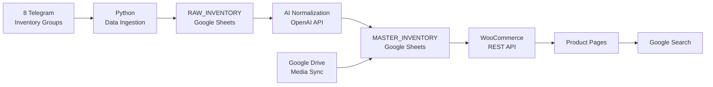

# Bukanbarukitchen.com (BBK) AI Growth Automation
AI-assisted inventory and e-commerce automation system transforming fragmented inventory feeds into structured, SEO-ready product data.

## The Problem

The business did not operate from a single warehouse or centralized inventory source.

Product inventory came from **8 independent Telegram groups**, each managed by different warehouse owners or administrators in the used commercial kitchen equipment network.

Each source had its own way of describing products, formatting specifications, posting images, communicating prices, and marking items as sold.

At the same time, the same inventory was accessible to dozens of independent marketers competing to sell the products.

This created several operational problems:

- Fragmented and inconsistent product data
- No standardized product naming or categorization
- Manual monitoring of inventory availability
- Repetitive processing of product images and descriptions
- Difficulty scaling thousands of products into structured web content
- Competition for the same inventory among multiple independent marketers

Instead of manually processing each product, I began building a system that could turn these fragmented inventory feeds into a structured data pipeline.

## System Architecture

The system converts fragmented inventory feeds into structured e-commerce data through a staged pipeline.



### Pipeline

**1. Inventory Ingestion**  
Python scripts collect product information and media references from multiple Telegram inventory groups.

**2. Raw Staging**  
Incoming data is stored in `RAW_INVENTORY`, preserving the source data before transformation.

**3. AI-Assisted Normalization**  
Google Apps Script sends raw product data to the OpenAI API using structured prompting rules. The model returns standardized product information in a predefined JSON format.

**4. Master Inventory**  
Validated output is written to `MASTER_INVENTORY`, which acts as the operational source of truth for publishing.

**5. Media Synchronization**  
Product images stored in Google Drive are mapped back to inventory records using product identifiers.

**6. WooCommerce Publishing**  
Eligible products are published in controlled batches through the WooCommerce REST API.

**7. Organic Discovery**  
Published products become part of the site's searchable and indexable content infrastructure.

## AI-Assisted Normalization

Raw inventory data is not reliable enough to publish directly. Product captions from different sources vary in naming conventions, specifications, formatting, and completeness.

To standardize this data, I designed an AI-assisted normalization layer between `RAW_INVENTORY` and `MASTER_INVENTORY`.

### How It Works

1. Google Apps Script reads unprocessed records from `RAW_INVENTORY`.
2. Raw product data is sent to the OpenAI API with predefined normalization rules.
3. The model is required to return a structured JSON response rather than free-form text.
4. The response is parsed and validated before being written to `MASTER_INVENTORY`.
5. Products are processed in controlled batches to stay within execution and API constraints.

### Output Contract

The AI layer produces structured fields such as:

```json
{
  "product_title": "...",
  "category": "...",
  "specifications": "...",
  "seo_keyword": "...",
  "meta_description": "...",
  "full_description": "..."
}
...

## Engineering Decisions

The system was designed around operational reliability rather than maximum processing speed.

### Raw vs. Master Data

Inventory data is separated into two layers:

- `RAW_INVENTORY` preserves incoming source data before transformation.
- `MASTER_INVENTORY` contains normalized and validated records used by downstream processes.

This separation allows the original source data to remain traceable while preventing incomplete or malformed records from being published directly.

### Change Detection

The workflow uses `HASH_DATA` and `IS_DIRTY` fields to identify records that have changed.

Instead of repeatedly processing every product, downstream operations can focus on records that require synchronization or republishing.

### Resource-Aware Batch Processing

The pipeline intentionally processes data in controlled batches:

- AI normalization: up to **10 products per execution**
- WooCommerce publishing: up to **5 products per execution**

These limits were introduced after considering Google Apps Script execution constraints, API usage, and WooCommerce server stability.

The objective is not instant bulk processing, but a pipeline that can operate repeatedly and predictably as inventory volume grows.

### Failure Isolation

The staged architecture separates ingestion, normalization, media synchronization, and publishing.

A failure in one stage therefore does not require the entire inventory pipeline to be restarted from the beginning.

## Verified Scale & Results

The system has been used on a live commercial kitchen equipment operation rather than as a standalone technical demo.

| Metric | Result |
|---|---:|
| Inventory managed | 2,333 SKUs |
| Product URLs in sitemap | 2,000 |
| Geographic targets | 183 districts |
| Google Search impressions | 24,307 |
| Organic clicks | 883 |
| Ahrefs Health Score | 67 |

> Search performance represents Google Search Console data from Indonesia over a 12-month period.

### Operational Scale

The pipeline was designed to manage a continuously changing inventory rather than a static product catalog.

Products originate from multiple independent warehouse sources, meaning availability, descriptions, images, specifications, and sold status can change independently.

The automation reduces the amount of repetitive work required to transform this fragmented inventory into structured product data and publishable web content.

### Organic Growth Infrastructure

Beyond individual product listings, the project includes a geo-aware SEO structure targeting **183 districts across Greater Jakarta**.

This combines:

- Product-level search demand
- Location-based search intent
- Structured internal linking
- On-page SEO
- Search-oriented content architecture
- Technical indexation monitoring

The resulting infrastructure connects inventory operations with organic search acquisition rather than treating SEO as a separate content activity.
