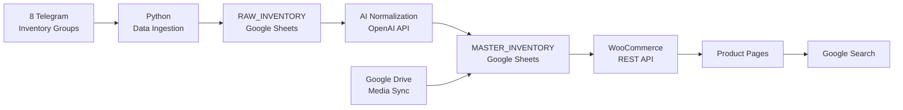

# System Architecture

```mermaid
flowchart LR
    A["8 Telegram<br/>Inventory Groups"]
    B["Python<br/>Data Ingestion"]
    C["RAW_INVENTORY<br/>Google Sheets"]
    D["AI Normalization<br/>OpenAI API"]
    E["MASTER_INVENTORY<br/>Google Sheets"]
    F["Google Drive<br/>Media Sync"]
    G["WooCommerce<br/>REST API"]
    H["Product Pages"]
    I["Google Search"]

    A --> B
    B --> C
    C --> D
    D --> E
    F --> E
    E --> G
    G --> H
    H --> I
```
